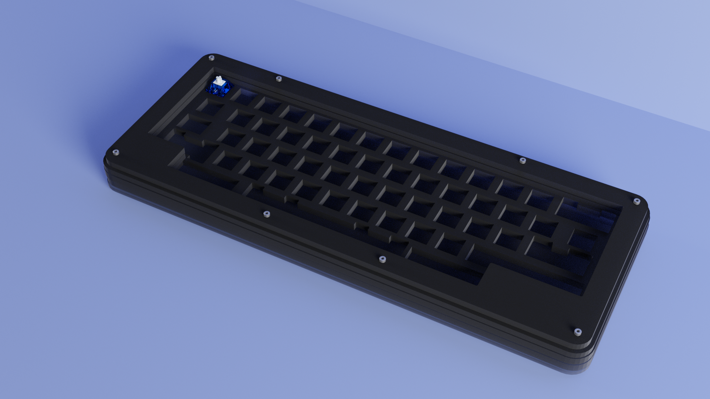
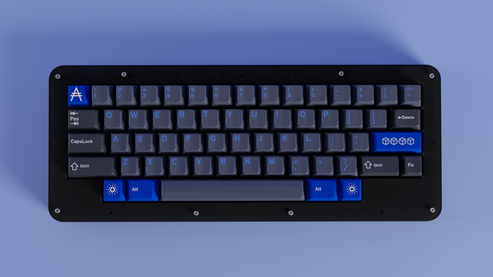
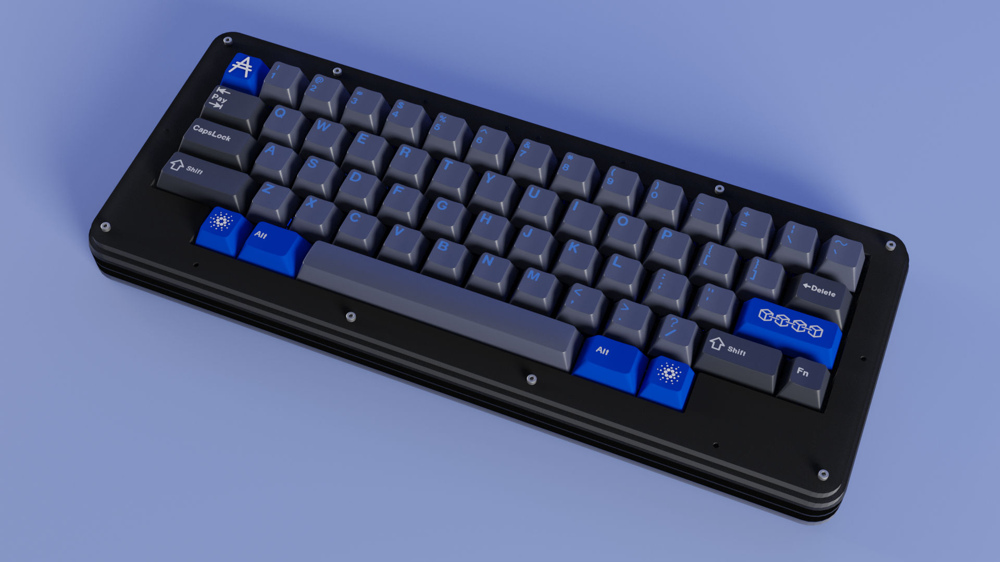

# IkCase-hhkb

_An original HHKB layout Acrylic Case_

_Stacked Acrylic Case for original Happy Hacking Keyboard layout, compatible with standard 60% PCBs_

The goal of this project is to offer a stacked acrylic alternative to the original HHKB case. This alternative has some measurements modifications to get the best fit between the PCB and the case.

## Layout:

- **Top row**: The right corner can be a 2 1U keys (like the renders) or a 1 2U stab key.  

- **Bottom row - Fixed Layout**: 1U left Super, 1.5U left Alt, 6.25U space bar, 1.5U right Alt, 1U right Super. 

---

## Acrilic Layers

The case is made with 5 layers of acrylic that are stacked on top of each other and held together with 8 **M3** screws (screw holes are 3mm diameter). 
Note that this case has been developed for a PCB that has the **USB underneath of the PCB**. This case **won't fit with a PCB that has the USB on top**. 

- **L6**: The top piece of the case. The ideal thickness is 4mm (4 millimetres). 

- **L5**: This piece is much similar to the top piece and the ideal thickness is also 4mm (4 millimetres). 

- **L4-plate-hhkb**: This is the switchplate of the keyboard. Will hold the switches and the ideal thickness is 5mm (5 millimetres). 

- **L1_L2_L3**: This piece is placed between the plate and the base piece to offer space to the PCB and the ideal thickness is 5mm (5 millimetres). 

- **L0**: The bottom piece that closes the case. The ideal thickness is 3mm (3 millimetres). Like **L1_L2_L3** piece, has the USB port exit. 

---
## Final Prototype

